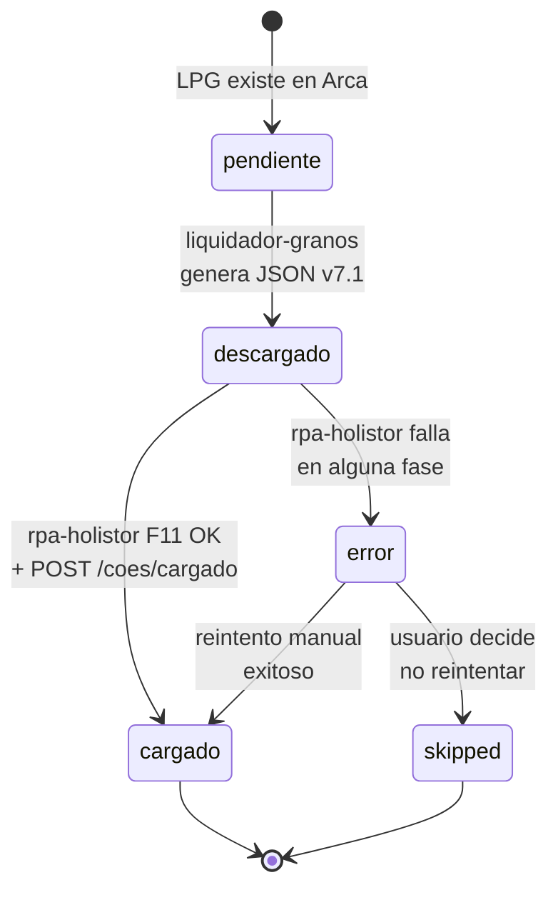
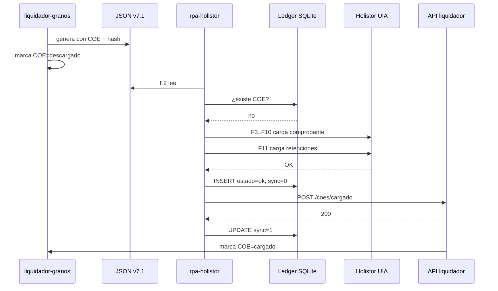
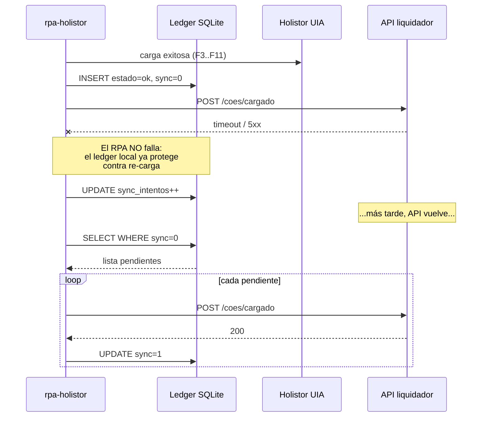
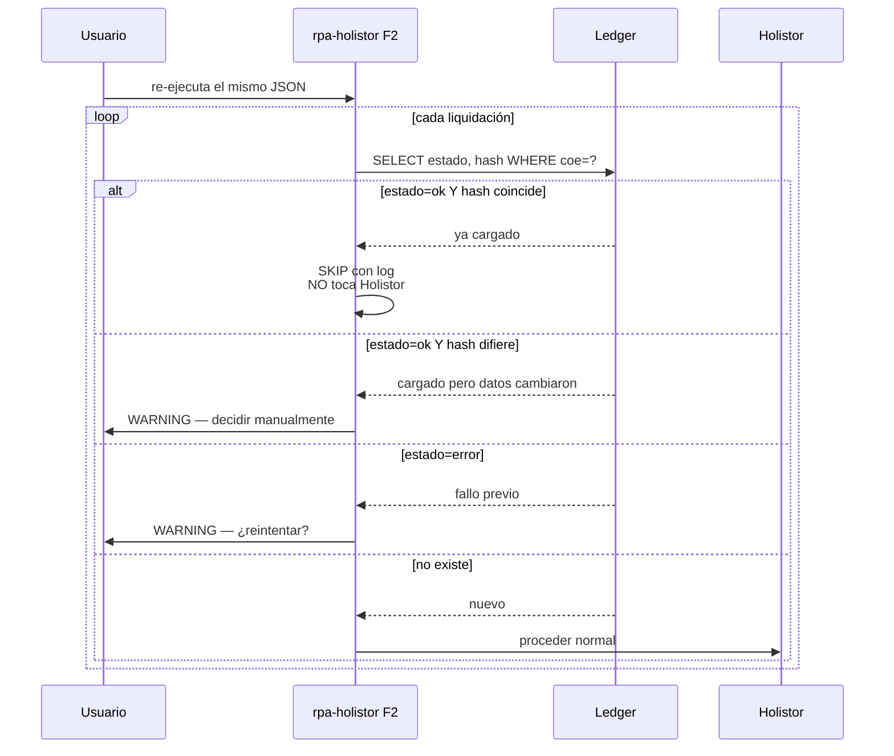

# Integración liquidador-granos ↔ rpa-holistor — Ledger de COEs + API

Documento de diseño para la feature de tracking de COEs cargados en Holistor.
Establece el ledger local (SQLite), los cambios al contrato JSON v7 y la API
entre ambos proyectos.

**Estado:** diseño aprobado, pendiente implementación.
**Fecha:** 2026-04-24.

---

## Motivación

Sin tracking, un mismo COE puede cargarse dos veces en Holistor si el usuario
re-ejecuta un JSON, o si `liquidador-granos` vuelve a incluirlo en un batch
futuro. Necesitamos:

1. **Idempotencia** en rpa-holistor: no recargar un COE ya procesado.
2. **Comunicación** de vuelta a liquidador-granos: qué COEs quedaron cargados,
   para que no los re-emita.
3. **Resiliencia**: si la API está caída, el RPA sigue funcionando.

---

## 1. Arquitectura general

```
┌─────────────────────────────┐                    ┌──────────────────────────────┐
│   liquidador-granos         │                    │   rpa-holistor (este repo)   │
│   (otro repo, otro equipo)  │                    │                              │
│                             │                    │                              │
│  ┌───────────────────────┐  │   1. JSON v7.1     │  ┌────────────────────────┐  │
│  │ WebService LPG (Arca) │──┼────(con COE)──────▶│  │  F2: Parser + check    │  │
│  └───────────┬───────────┘  │                    │  │  ledger por COE        │  │
│              ▼              │                    │  └───────────┬────────────┘  │
│  ┌───────────────────────┐  │                    │              │               │
│  │ DB estado COEs        │  │   4. GET estado    │              ▼               │
│  │ pendiente→descargado  │◀─┼────(opcional)──────│  ┌────────────────────────┐  │
│  │ →cargado              │  │                    │  │  F3..F11: carga en     │  │
│  └───────────▲───────────┘  │                    │  │  Holistor vía UIA      │  │
│              │              │                    │  └───────────┬────────────┘  │
│  ┌───────────┴───────────┐  │                    │              │               │
│  │  API FastAPI          │  │   3. POST cargado  │              ▼               │
│  │  POST /coes/cargado   │◀─┼────────────────────┼──┐ ┌────────────────────────┐│
│  │  GET  /coes/{coe}     │  │                    │  └─│ Ledger SQLite          ││
│  │  GET  /coes/estados   │  │                    │    │ state/coes_cargados.db ││
│  │  GET  /health         │  │                    │    └───────────┬────────────┘│
│  └───────────────────────┘  │                    │                │             │
│                             │                    │                ▼             │
│                             │                    │  ┌────────────────────────┐  │
│                             │                    │  │ Sync worker            │  │
│                             │                    │  │ drena pendientes→API   │  │
│                             │                    │  └────────────────────────┘  │
└─────────────────────────────┘                    └──────────────────────────────┘
```

---

## 2. Máquina de estados de un COE (vista global)



| Estado | Dueño | Semántica |
|---|---|---|
| `pendiente` | liquidador-granos | Arca lo tiene, no lo bajamos todavía |
| `descargado` | liquidador-granos | Está en un JSON v7.1 emitido, el RPA lo verá |
| `cargado` | ambos | Ya entró a Holistor, no volver a cargar |
| `error` | ambos | Intento fallido, posibles datos parciales en Holistor |
| `skipped` | rpa-holistor | Descartado explícitamente |

---

## 3. Flujo normal (API viva) — una liquidación



---

## 4. Flujo con API caída (resiliencia)



---

## 5. Flujo de re-ejecución (idempotencia)



---

## 6. Schema del ledger (visual)

```
┌──────────────────── coes_cargados ────────────────────┐
│ PK  coe                  TEXT     "12345678901234"    │
├───────────────────────────────────────────────────────┤
│     cuit_empresa         TEXT     "30711165378"       │
│     cuit_comprador       TEXT     "30708729929"       │
│     codigo_comprobante   TEXT     "F2"                │
│     tipo_pto_vta         INTEGER  3302                │
│     nro_comprobante      INTEGER  30384098            │
│     fecha_emision        TEXT     "2026-02-26"        │
│     mes / anio           INTEGER  2 / 2026            │
├─── estado ────────────────────────────────────────────┤
│     estado               TEXT     ok|error|skipped    │
│     error_fase           TEXT     "F11"               │
│     error_mensaje        TEXT     "crash Holistor..." │
├─── trazabilidad ──────────────────────────────────────┤
│     ejecucion_id         TEXT     "run_uuid_xyz"      │
│     usuario              TEXT     "mateo.adan"        │
│     cargado_en           TEXT     ISO 8601            │
│     hash_payload         TEXT     "sha256:..."        │
├─── sync al API ───────────────────────────────────────┤
│     sincronizado_api     INTEGER  0|1                 │
│     sincronizado_en      TEXT     ISO 8601            │
│     sync_intentos        INTEGER  0..N                │
│     sync_ultimo_error    TEXT     "timeout"           │
└───────────────────────────────────────────────────────┘

  Índices:
    idx_coes_empresa_estado  (cuit_empresa, estado)
    idx_coes_pendientes_sync (sincronizado_api) WHERE = 0
```

### DDL completo

```sql
CREATE TABLE coes_cargados (
    coe                TEXT PRIMARY KEY,              -- clave natural LPG (14 dígitos)
    cuit_empresa       TEXT NOT NULL,
    cuit_comprador     TEXT NOT NULL,
    codigo_comprobante TEXT NOT NULL,                 -- F1 | F2 | NL
    tipo_pto_vta       INTEGER NOT NULL,
    nro_comprobante    INTEGER NOT NULL,
    fecha_emision      TEXT NOT NULL,                 -- ISO YYYY-MM-DD
    mes                INTEGER NOT NULL,
    anio               INTEGER NOT NULL,

    estado             TEXT NOT NULL,                 -- ok | error | skipped
    error_mensaje      TEXT,
    error_fase         TEXT,                          -- F7, F10, F11, etc.

    ejecucion_id       TEXT NOT NULL,                 -- UUID por corrida del RPA
    usuario            TEXT NOT NULL,                 -- getpass.getuser()
    cargado_en         TEXT NOT NULL,                 -- ISO 8601 con TZ

    hash_payload       TEXT NOT NULL,                 -- sha256 de la liquidación del JSON

    sincronizado_api   INTEGER NOT NULL DEFAULT 0,    -- 0 | 1
    sincronizado_en    TEXT,
    sync_intentos      INTEGER NOT NULL DEFAULT 0,
    sync_ultimo_error  TEXT
);

CREATE INDEX idx_coes_empresa_estado ON coes_cargados(cuit_empresa, estado);
CREATE INDEX idx_coes_pendientes_sync ON coes_cargados(sincronizado_api) WHERE sincronizado_api = 0;
```

### Reglas de uso

- **F2 (Leer entrada)** — para cada liquidación del JSON: `SELECT estado FROM coes_cargados WHERE coe = ?`.
  - Si `ok` → skip con log, no vuelve a entrar al flujo.
  - Si `error` → warning + flag configurable (`--reintentar-errores`). Default: skip, forzar decisión manual.
  - Si no existe → procesa.
- **F11 (fin del flujo exitoso)** — INSERT con `estado='ok'`, `sincronizado_api=0`.
- **Cualquier FAIL de fase** — INSERT con `estado='error'`, `error_fase=<fase>`, `error_mensaje`.
- **Sync al API** — al arranque de la app y después de cada liquidación, worker drena `WHERE sincronizado_api = 0` con backoff.

**Por qué `hash_payload`:** si `liquidador-granos` reemite el mismo COE con datos corregidos (p.ej. corrigió la alícuota), el hash cambia y podemos decidir re-cargar. Sin el hash no distinguiríamos "mismo COE, mismos datos" de "mismo COE, datos nuevos".

---

## 7. Dónde engancha el ledger en el flujo de fases

```
  F2 Leer entrada                    F11 Retenciones (fin exitoso)
  ┌──────────────────────┐           ┌──────────────────────────┐
  │ parsea JSON          │           │ verifica totales OK      │
  │ para cada liquidación│           │ cierra modal             │
  │   ┌────────────────┐ │           │   ┌────────────────────┐ │
  │   │ ledger.check   │ │           │   │ ledger.marcar_ok() │ │
  │   │ (coe, hash)    │ │           │   │ api.reportar()     │ │
  │   └───────┬────────┘ │           │   └────────────────────┘ │
  │     skip / procesar  │           └──────────────────────────┘
  └──────────────────────┘
                                     Cualquier fase FAIL
                                     ┌──────────────────────────┐
                                     │ ledger.marcar_error()    │
                                     │ (fase, mensaje)          │
                                     │ api.reportar()           │
                                     └──────────────────────────┘
```

---

## 8. Evolución del contrato JSON

```
         v7 (actual)                         v7.1 (propuesto)
  ┌──────────────────────┐           ┌──────────────────────────┐
  │ liquidaciones: [     │           │ schema_version: "v7.1"   │
  │   {                  │           │ meta: {                  │
  │     cuit_empresa,    │           │   generado_en,           │
  │     comprobante,     │   ───▶    │   generador,             │
  │     grano,           │           │   batch_id               │
  │     retenciones,     │           │ }                        │
  │     deducciones      │           │ liquidaciones: [         │
  │   }                  │           │   {                      │
  │ ]                    │           │     coe,          ◀── NEW│
  └──────────────────────┘           │     id_liquidacion,◀─ NEW│
                                     │     estado_origen, ◀─ NEW│
                                     │     ...resto igual       │
                                     │   }                      │
                                     │ ]                        │
                                     └──────────────────────────┘
         sin clave de                        COE como clave
         idempotencia                        natural de idempotencia
```

### Ejemplo v7.1 completo

```jsonc
{
  "schema_version": "v7.1",
  "meta": {
    "generado_en": "2026-04-24T10:30:00-03:00",
    "generador": "liquidador-granos@1.2.3",
    "batch_id": "b_20260424_103000"
  },
  "liquidaciones": [
    {
      "coe": "12345678901234",             // NUEVO — obligatorio
      "id_liquidacion": "liq_abc123",      // NUEVO — opcional
      "estado_origen": "descargado",       // NUEVO — opcional

      "cuit_empresa": "30711165378",
      "mes": 2,
      "anio": 2026,
      "cuit_comprador": "30708729929",
      "cuit_proveedor": "20102139063",

      "comprobante": {
        "codigo": "F2",
        "tipo_pto_vta": 3302,
        "nro": 30384098,
        "fecha_emision": "2026-02-26"
      },
      "grano": { /* ... */ },
      "retenciones": [ /* ... */ ],
      "deducciones": [ /* ... */ ]
    }
  ]
}
```

**Breaking change:** `coe` pasa a ser obligatorio. El parser debe:
- Validar `coe` presente y con formato (14 dígitos numéricos).
- Fallar con error claro si falta (no asumir ni generar sintético).
- Aceptar `schema_version` `v7.1`; rechazar `v7` con mensaje "regenerar JSON con liquidador-granos ≥ 1.2.0".

---

## 9. Diseño de la API (en liquidador-granos)

### Stack

- **FastAPI** (Python, bajo boilerplate, OpenAPI automático).
- Servicio local: `uvicorn app:app --host 0.0.0.0 --port 8765`.
- Auth: header `X-API-Key` con valor en `.env`.
- Persistencia del lado liquidador: tabla `coes_estado` en su DB existente.

### Endpoints MVP

#### `POST /v1/coes/cargado`

Reporta que un COE fue cargado. **Idempotente** — el mismo `(coe, ejecucion_id)` no duplica.

```jsonc
// Request
{
  "coe": "12345678901234",
  "ejecucion_id": "run_uuid_xyz",
  "usuario": "mateo.adan",
  "cargado_en": "2026-04-24T10:45:12-03:00",
  "estado": "ok",                    // ok | error
  "hash_payload": "sha256:...",

  "comprobante": {
    "codigo": "F2",
    "tipo_pto_vta": 3302,
    "nro": 30384098,
    "fecha_emision": "2026-02-26"
  },

  "error_fase": null,
  "error_mensaje": null
}

// Response 200
{ "coe": "12345678901234", "estado_registrado": "ok", "duplicado": false }

// Response 409 si hash_payload difiere del último conocido
{ "error": "payload_mismatch", "hash_conocido": "...", "hash_recibido": "..." }
```

#### `GET /v1/coes/{coe}`

Estado actual de un COE (debugging / verificación puntual).

```jsonc
{
  "coe": "12345678901234",
  "cuit_empresa": "30711165378",
  "estado": "cargado",
  "descargado_en": "2026-04-23T18:00:00-03:00",
  "cargado_en": "2026-04-24T10:45:12-03:00",
  "ultima_ejecucion_id": "run_uuid_xyz"
}
```

#### `GET /v1/coes/estados?cuit_empresa=X&estado=Y`

Listado para dashboard / conciliación periódica.

#### `GET /v1/health`

Liveness probe.

### Política de reintentos desde rpa-holistor

- Timeout por request: 5s.
- Backoff exponencial: 1s, 3s, 10s, 30s → luego dejar en cola local y reintentar al próximo arranque.
- Si el API está caído: **el RPA sigue cargando normalmente** — el ledger local es suficiente para idempotencia. Solo se acumula deuda de sync.

### Contrato de errores estándar

```jsonc
{ "error": "<código_snake_case>", "mensaje": "<humano>", "detalle": { ... } }
```

Códigos: `api_key_invalida`, `coe_no_encontrado`, `payload_mismatch`, `validacion_fallida`, `interno`.

---

## 10. Orden de implementación propuesto

1. **Schema ledger + helper module** en rpa-holistor (`core/ledger.py`):
   `marcar_cargado()`, `esta_cargado()`, `pendientes_sync()`. Sin API todavía —
   funciona offline.
2. **Integrar ledger en F2 (check) y F11 (write)**. Con esto solo, ya hay
   idempotencia local. Testeable contra MANASRL.
3. **Cambio JSON v7 → v7.1**: agregar `coe` obligatorio en parser +
   `tools/generar_json_prueba.py` + actualizar CLAUDE.md. Coordinar con
   liquidador-granos.
4. **Cliente HTTP en rpa-holistor** (`core/api_client.py`) — stub que loggea
   si la API no está. Worker de drenaje de pendientes al arranque.
5. **API FastAPI en liquidador-granos** (repo aparte). Recién acá se cierra
   el loop.
